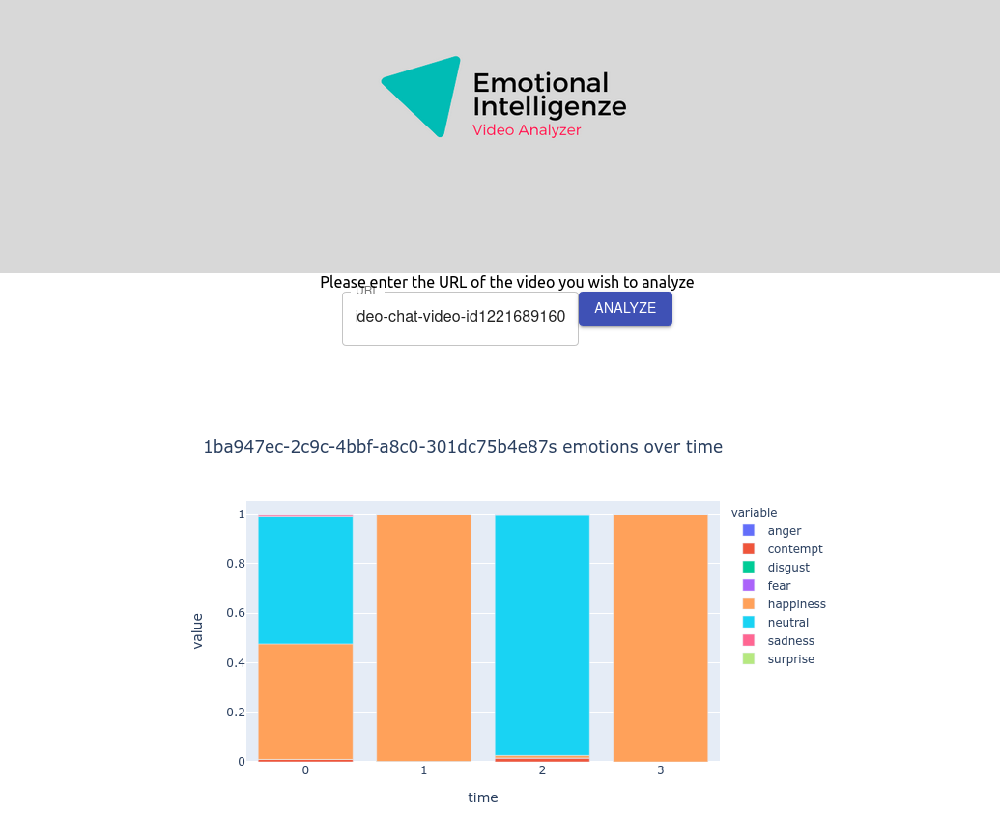

# Emotional Intelligenze app
Analyze your video conferences by submitting a link to them on this app! Gain insights into video participants' emotions
during the meeting.

## Set up frontend
Ensure that the backend of the app is running before starting the front end server.

1. Clone the repo
2. `cd frontend`
3. `yarn install`
4. `yarn start`

## How it works
Firstly, enter a URL for a video that is hosted online. (e.g. Zoom Cloud). Click the analyze button and wait for the results.

A image will pop up in your browser indicating the IDs assigned to each person in the meeting. This ID can be used to identiy their individual emotions.

For example, we analyzed [this](https://media.istockphoto.com/videos/group-of-six-friends-saying-cheers-over-video-chat-video-id1221689160) video and got this result.

## Set up backend

### Python Libraries used
Python 3 is required for this app.
- Flask
- Opencv
- Pandas
- Numpy

### APIs used
- [Azure Face API](https://azure.microsoft.com/en-us/services/cognitive-services/face/). Note that an API key needs to be generated to use this app.
    - Face detection
    - Face similarity

### Setup
1. Clone repo and `cd backend`
2. Set up a [python virtual environment](https://uoa-eresearch.github.io/eresearch-cookbook/recipe/2014/11/26/python-virtual-env/)
2. At project root run: `pip install -r requirements.txt`
3. Set up environment variables (refer to `analyzer.py`)
   - `AZURE_KEY_1` refers to the azure secret key
   - Windows [example](https://www.youtube.com/watch?v=IolxqkL7cD8)
4. `flask run`

Call APIs exposed easily through the frontend website.